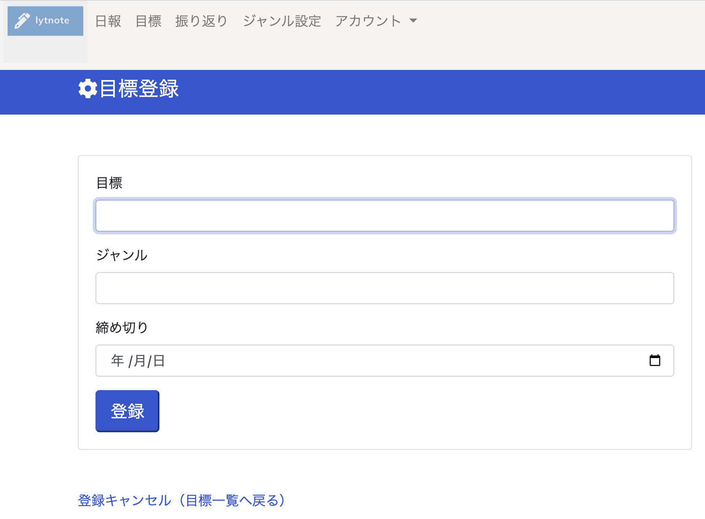
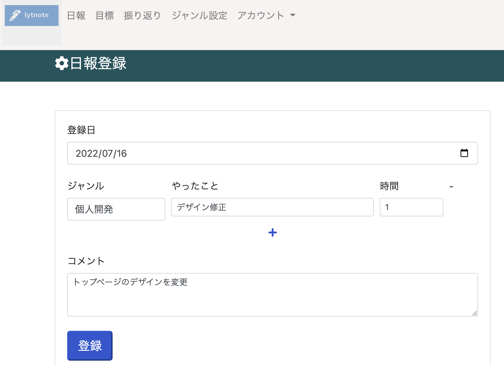
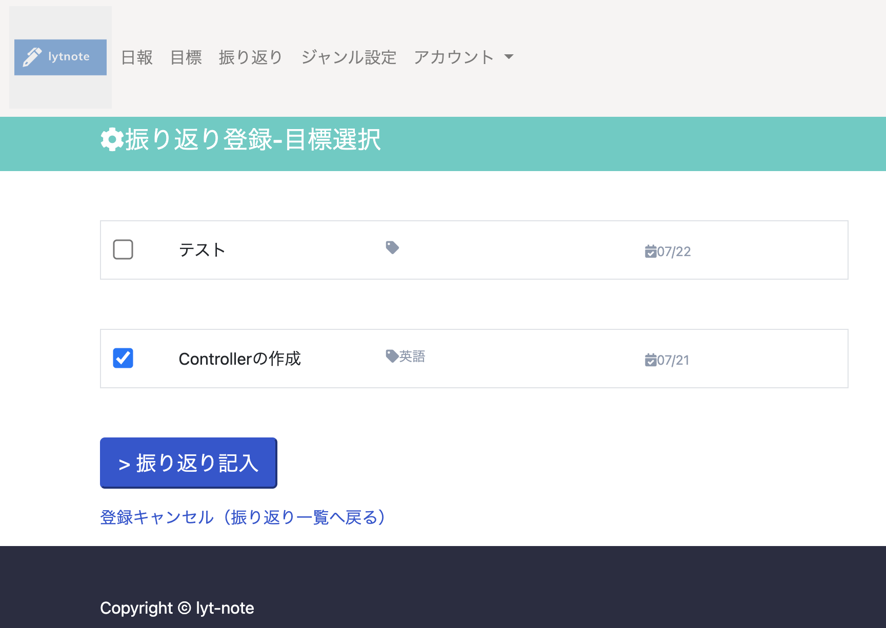
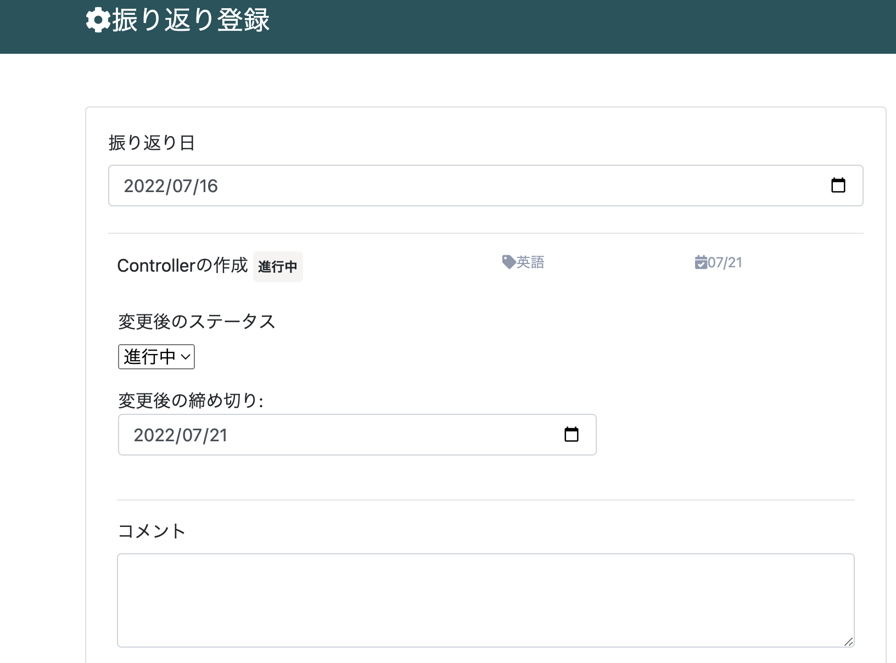

# lytnote（ライトノート）

## App URL

### **https://lytnote.onrender.com/**

## アプリの概要
 lytnote（ライトノート）は振り返り機能のついた日報作成アプリです。日々の記録に加えて、目標設定と振り返り機能を用いることで、よりよい生活を送ることができます。

## 課題
- 日報アプリは既存にあるが、振り返りもできるアプリはない
- 振り返りのフォーマットを自分で作成し、毎回打ち込むのは手間

## 解決方法
- 日報だけじゃなく、振り返り機能も付与したアプリを提供する
- 振り返り機能を使うことで、振り返り用文章が自動生成される

## 開発の経緯
　日々、プログラム向けの学習の内容を既存のアプリを用いて記録しています。
アプリがあるので楽にできます。

　ときどき目標を設定したり、それが達成できたかを確認します。これは既存のアプリにはない機能なので、自分でメモをせっせとつくるしかありません。面倒です。

　そこで記録に目標設定+振り返りの機能をつけた新しいアプリをつくることにしました。

　

## 使用方法

### STEP1: 目標設定

目標と締め切りを設定しましょう。難しく考えずにOK。

### STEP2: 日報登録

日々の作業を記録しましょう。かけた時間だけでなく、そのとき考えたこともコメントとして残すことができます。

### STEP3: 振り返り投稿

週に一度程度のペースで振り返りを行いましょう。目標を達成したかどうか、達成できなかった理由を記録します。

### STEP4: どんどん繰り返す！
Step1-3をどんどん繰り返しましょう。

## ⚙️ 使用技術
- Ruby 2.6.6
- Ruby on Rails  6.0.4.8
- RSpeck
- Bootstrap

## 💎 主なgem
- devise (ログイン)
- cocoon (項目の動的追加・削除)
- kaminari (ページネーション)

## 🌎 インフラストラクチャー 
- Render.com (PaaSサービス)

## ER図

